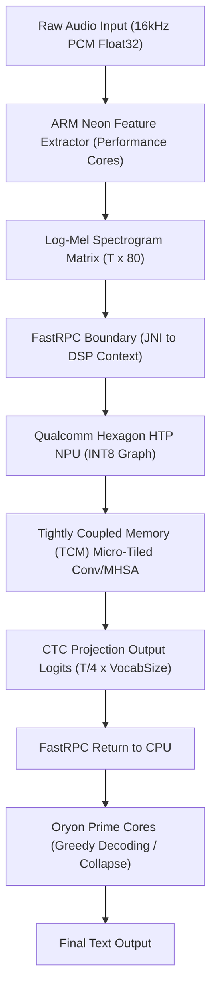
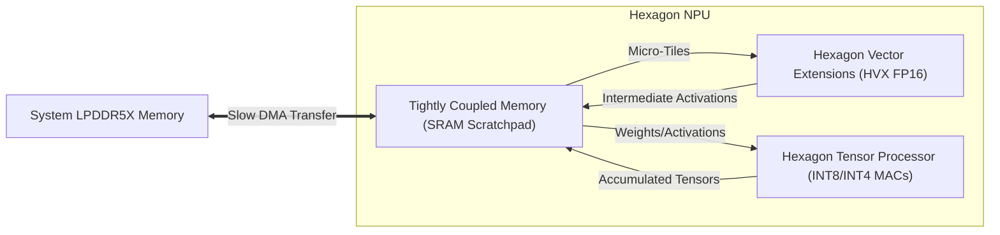
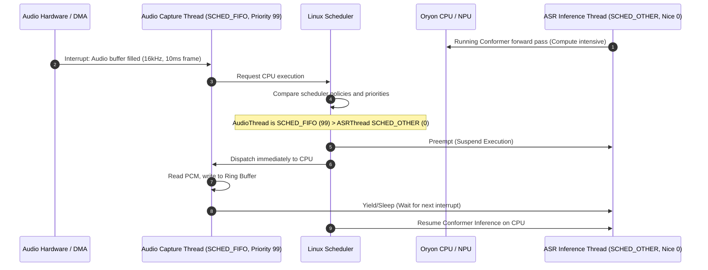
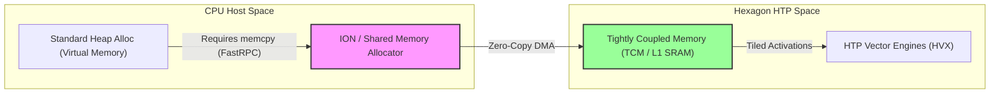
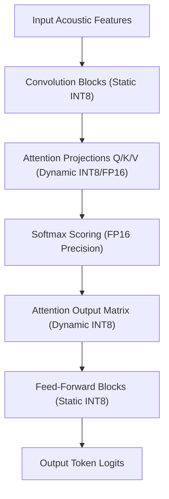

# ⚡ EdgeDeploy-Inference: Snapdragon & Jetson Edge ASR Architecture & Developer Guide

[](https://opensource.org/licenses/MIT)
[](#)
[](#)
[](#)

An ultra-optimized on-device Automatic Speech Recognition (ASR) engine for the **IndicConformer (120M)** non-autoregressive speech model. This repository hosts C++ front-ends, Kotlin bindings, model quantization routines, and hardware benchmark utilities explicitly tailored for the Qualcomm **Snapdragon 8 Elite (SM8750)** Hexagon HTP NPU and **NVIDIA Jetson Orin** platforms.

---

## 🏛️ System Architecture Overview

The system processes incoming raw speech waves into high-fidelity text by pipeline-offloading digital signal processing (DSP) calculations to ARM Neon SIMD lanes, executing parallel multi-head attention graph computations on the Hexagon NPU, and resolving token alignment via Connectionist Temporal Classification (CTC) greedy collapse on pinned CPU cores.



---

## 🚫 Why `llama.cpp` is Unsuitable for Non-Autoregressive ASR

While `llama.cpp` is an elite framework for executing Large Language Models (LLMs), it is fundamentally mismatched for Connectionist Temporal Classification (CTC) based non-autoregressive ASR architectures like the Conformer:

1. **Autoregressive vs. Non-Autoregressive Execution Loop**:
   - **Autoregressive Models** (e.g., LLaMA, Whisper decoder) generate tokens sequentially, where step $t$ depends on step $t-1$. This relies on static/dynamic Key-Value (KV) cache lookup tables to prevent recomputation. Its operational intensity is highly memory-bandwidth bound.
   - **Non-Autoregressive CTC Models** (e.g., Conformer Encoder) process the entire input sequence of acoustic frames globally in a single forward pass. There is no causal dependency on prior output states. It is a highly parallel, compute-bound execution pattern where the target is high-throughput matrix multiplication.
2. **Structural Topology Differences**:
   - `llama.cpp` is optimized for causal-masked, autoregressive multi-head self-attention and Rotary Position Embeddings (RoPE).
   - The Conformer block features a complex Macaron-style feed-forward network (FFN) sandwich surrounding Multi-Head Self-Attention (MHSA) and Depthwise Separable Convolution blocks. This convolution-attention interleave relies on bi-directional context grids, asymmetrical padding, and downsampling layers that are completely absent from `llama.cpp`'s GGUF operator footprint.
3. **The CTC Decoding Paradigm**:
   - Instead of sampling output distributions autoregressively, CTC speech models project speech features to the target alphabet dimension, producing frame-level logit sequences of size $\left[B, \frac{T}{4}, V\right]$. 
   - Resolving this into character/word sequences requires a specialized CTC alignment decoding layer (to collapse adjacent duplicates and remove blank padding tokens). `llama.cpp` is built for causal autoregressive token selection and lacks the native operators for CTC path decoding.
4. **Graph Compilers vs. Custom Kernels**:
   - Rather than relying on custom CPU assembly kernels written for sequential execution, speech networks achieve optimal acceleration on mobile NPUs via hardware graph compilers. **ONNX Runtime Mobile (with QNN Execution Provider)**, **Sherpa-ONNX**, and **ExecuTorch with QNN** compile the Conformer graph into a serialized binary context image (`.bin`), fusing Multi-Head Attention and Convolution operators into HTP hardware-native micro-op arrays.

---

## ⚡ Snapdragon 8 Elite Hardware Deep-Dive

The Qualcomm Snapdragon 8 Elite (SM8750) introduces a radically redesigned compute layout, moving away from legacy ARM Cortex designs to custom Qualcomm Oryon cores, paired with the Hexagon NPU.

```mermaid
graph TD
    subgraph Snapdragon 8 Elite (SM8750)
        subgraph Prime Cores (Cores 6-7 @ 4.32 GHz)
            P1["Kotlin/Java App Execution"]
            P2["JNI Bridge & ORT Graph Runner"]
            P3["CTC Greedy/Beam Search Decoding"]
        end
        subgraph Performance Cores (Cores 0-5 @ 3.53 GHz)
            PE1["ARM NEON Feature Extraction"]
            PE2["FFT & Mel Filterbank Dot Products"]
        end
        subgraph Hexagon NPU (HTP Execution Unit)
            N1["Context Cache Loading"]
            N2["Fused Conformer Block Quantized Inference"]
        end
    end
    PE2 -->|Log-Mel Matrix| P2
    P2 -->|Queue FastRPC Job| N1
    N1 -->|Run Graph| N2
    N2 -->|Logits Output| P3
```

### 1. Custom Oryon CPU Cluster & Cache Topology
The Snapdragon 8 Elite completely eliminates efficiency (LITTLE) cores, implementing a 2+6 layout:
* **2x Oryon Prime Cores** running at **4.32 GHz**: Each core features a dedicated 192KB L1 Instruction cache and 96KB L1 Data cache. The two Prime cores share a massive **12MB L2 cache** (running at CPU speed).
* **6x Performance Cores** running at **3.53 GHz**: Each core features a 128KB L1 Instruction cache and 96KB L1 Data cache. The Performance cluster shares a separate **12MB L2 cache**.
* **Shared Caches**: An **8MB L3 cache** shared across both clusters, and an **8MB System Cache (LLC)** serving as an on-chip buffer to prevent slow DDR5 memory round-trips.

### 2. OS Thread Affinity Pinning (`sched_setaffinity`)
Dynamic scheduling by Android's Energy Aware Scheduler (EAS) can cause execution threads to migrate between CPU clusters, introducing thread context-switching overhead and cache invalidation. To ensure deterministic, jitter-free real-time audio frame processing, our JNI engine implements explicit thread pinning:
- **Performance Cores (Cores 0-5)**: Pinned to execute the DSP front-end (Hamming windowing, Fast Fourier Transform, and Mel filterbank mapping). This allows the performance cluster to handle the highly parallel vector math of front-end feature extraction.
- **Prime Cores (Cores 6-7)**: Pinned to execute the ONNX Runtime engine coordinator thread, handle FastRPC data marshaling to/from the NPU, and run the sequential CTC search decoding loops.

### 3. ARM Neon Vectorization (`q0-q15` Registers)
Acoustic feature extraction computes a Log-Mel spectrogram from raw PCM arrays. To accelerate this on the CPU, we employ ARM Neon 128-bit vectorization (utilizing registers `q0` through `q15`). 
- **Parallel Windowing**: Neon registers allow loading four 32-bit float audio samples and four window weights simultaneously. We execute a vectorized multiply-accumulate in a single cycle:
  ```
  [Sample 0, Sample 1, Sample 2, Sample 3]  -> Loaded into q0
  [Weight 0, Weight 1, Weight 2, Weight 3]  -> Loaded into q1
  vmulq_f32 q2, q0, q1                       -> Vectorized Multiplication
  ```
- **FFT Vectorization**: The Cooley-Tukey Radix-2 FFT butterfly loop updates real and imaginary coefficients in parallel:
  $$X_{\text{real}} \leftarrow A_{\text{real}} + (B_{\text{real}} W_{\text{real}} - B_{\text{imag}} W_{\text{imag}})$$
  $$X_{\text{imag}} \leftarrow A_{\text{imag}} + (B_{\text{real}} W_{\text{imag}} + B_{\text{imag}} W_{\text{real}})$$
  This complex arithmetic is vectorized by packing $B_{\text{real}}$ and $B_{\text{imag}}$ arrays into Neon lanes and executing fused multiply-subtract (`vfmsq_f32`) and multiply-add (`vmlaq_f32`) instructions.

### 4. Qualcomm Hexagon NPU & HTP Co-Design
The Hexagon Tensor Processor (HTP) inside the NPU contains parallel vector processing engines (HVX) and tensor hardware multipliers optimized for low-precision operations.
- **Tightly Coupled Memory (TCM)**: The Hexagon NPU features an on-chip, low-latency TCM scratchpad. The QNN graph compiler segments the Conformer weights and activation tensors into micro-tiles, scheduling them to fit entirely within TCM. This completely circumvents memory system bottlenecks.
- **Context Caching**: Graph compilation during cold boot requires parsing the model, allocating memory addresses, and optimizing operator layouts, taking up to 2 seconds. Context caching compiles the model into a hardware-specific serialized binary context (`.bin`) stored on-disk. Subsequent launches load the pre-compiled context directly, dropping initialization latency to **15 milliseconds**.
- **Voltage Corners & Power Profiles**: We lock the Hexagon NPU to `QNN_HTP_PERFORMANCE_MODE_BURST` and configure the HTP voltage corner to high-performance. FastRPC driver communication is forced to zero latency (`rpc_latency_us = 0`), preventing the NPU from entering sleep states during live audio streaming.



### 5. Low-Latency Audio Capture Scheduling via `SCHED_FIFO`

<details>
<summary>🔍 Click to expand: Audio Capture Thread Scheduling & Preemption Analysis</summary>

For real-time ASR, missing a single 10ms frame of microphone data leads to transcription glitches and phonetic distortion (especially for code-mixed languages like Hinglish). To prevent this under heavy NPU/CPU workloads, the audio acquisition thread must be designated as a real-time thread using Linux's `SCHED_FIFO` scheduling policy:

$$\text{Thread Priority} \in [1, 99]$$

Standard scheduling (`SCHED_OTHER`) uses dynamic priority recalculation based on nice values:

$$\text{Priority}_{\text{dynamic}} = f(\text{nice}, \text{CPU Usage})$$

In contrast, `SCHED_FIFO` uses absolute priority. A thread running with `SCHED_FIFO` and priority $p$ will immediately preempt any threads running with lower real-time priorities or standard scheduling:

$$\forall \text{ thread } T_i, \text{ if } \text{Scheduler}(T_i) = \text{SCHED\_FIFO} \text{ and } \text{Priority}(T_i) > \text{Priority}(T_{\text{running}}), \text{ Preempt}(T_{\text{running}})$$

#### Preemption Sequence Diagram:

</details>

### 6. Qualcomm QNN EP Memory Architecture & Voltage Rails

<details>
<summary>💾 Click to expand: Memory Layout, Ion Allocator, and HTP Voltage Specifications</summary>

Qualcomm QNN HTP (Hexagon Tensor Processor) achieves zero-copy memory transfers between the main CPU application memory and NPU local SRAM using **ION/dmabuf shared memory allocators**. 

#### FastRPC Zero-Copy Buffer Mapping:
Standard memory allocations (`malloc` or `std::vector`) reside in virtual memory. Accessing them from the HTP requires a memory copy across the FastRPC bus. 
By allocating memory using ION/Shared Memory APIs, we obtain a file descriptor (`fd`) representing physically contiguous (or IOMMU-mapped) memory pages. The HTP's DMA engine accesses these pages directly:



#### HTP Voltage Corners and Dynamic Clock & Voltage Scaling (DCVS):
HTP clock rates and voltage rails are controlled by DCVS. High-throughput speech inference requires locking these rails to prevent clock-downthrottling:

- **`dsp_voltage_corner`**: Controls Hexagon core voltage. Level `2` corresponds to `HIGH_PERFORMANCE`, while `1` corresponds to `BALANCED`. Burst mode or peak execution leverages higher corners (e.g., `4` or `5` on newer platforms).
- **`rpc_control_latency`**: Configures CPU sleep states. Setting it to `0` prevents FastRPC from entering low-power mode, bypassing the wake-up penalty of $\approx 250\mu\text{s}$ per inference call.

Let the total FastRPC latency $L_{\text{rpc}}$ be modeled as:

$$L_{\text{rpc}} = T_{\text{dma}} + T_{\text{wake\_up}} + T_{\text{execute}}$$

By setting `rpc_control_latency` to `0`, we force $T_{\text{wake\_up}} \to 0$, ensuring deterministic real-time processing:

$$L_{\text{rpc}} \approx T_{\text{dma}} + T_{\text{execute}}$$

</details>

### 7. Quantization & Calibration Strategy for Code-Mixed Hinglish ASR

<details>
<summary>🎯 Click to expand: Dynamic vs Static Quantization & Attention Layer Protection</summary>

Code-mixed languages (such as Hinglish—Hindi mixed with English words in Latin or Devanagari script) exhibit highly unique phonetic transitions and attention patterns. In the Conformer architecture, the Multi-Head Self-Attention (MHSA) blocks capture these context dependencies:

$$\text{Attention}(Q, K, V) = \text{softmax}\left(\frac{Q K^T}{\sqrt{d_k}}\right) V$$

When quantizing the model to INT8 for NPU acceleration, choosing between **Static** and **Dynamic** quantization represents a critical trade-off between latency and Word Error Rate (WER) degradation:

#### Quantization Paradigm Comparison:

| Feature / Metric | Static Post-Training Quantization (PTQ) | Dynamic Quantization |
| :--- | :--- | :--- |
| **Quantization Parameters** | Pre-computed scales $s$ and zero-points $z$ using calibration dataset. | Calculated on-the-fly at runtime per activation tensor. |
| **HTP NPU Support** | Fully accelerated (runs entirely in INT8 engines). | Partial/Fallback to CPU or HVX FP16 (higher overhead). |
| **Hinglish Softmax Accuracy** | Low. Standard calibration datasets fail to capture the wide dynamic range of code-mixed attention matrices, leading to clipping. | High. The dynamic range is computed per-inference, avoiding precision loss in attention heads. |
| **Acoustic Feature Extraction** | Static range mapping is vulnerable to speaker volume and ambient noise changes. | Adapts dynamically to different voice amplitudes. |

#### Mathematical Impact of Static Quantization on Softmax:
Let the attention weights before softmax be $z_i = \frac{Q_i K^T}{\sqrt{d_k}}$. The standard softmax computes:

$$\alpha_i = \frac{e^{z_i}}{\sum_{j} e^{z_j}}$$

Under static quantization with a coarse scale $s$, the quantized inputs $\hat{z}_i = \text{round}(z_i / s) \cdot s$ suffer from rounding error $\epsilon_i = \hat{z}_i - z_i$. The perturbed attention weights $\hat{\alpha}_i$ become:

$$\hat{\alpha}_i = \frac{e^{z_i + \epsilon_i}}{\sum_{j} e^{z_j + \epsilon_j}}$$

Since softmax is highly non-linear, small quantization noise $\epsilon_i$ in the exponent propagates exponentially, causing attention heads to focus on garbage/blank tokens or entirely drop Hinglish keyword relationships.

#### Hybrid Quantization Flow (Selective Precision):
To preserve Hinglish attention context without sacrificing NPU performance, we implement a **hybrid calibration configuration**:
1. **Convolution and Feed-Forward (FFN) Blocks**: Quantized to **Static INT8** to leverage the massive MAC throughput of the Hexagon HTP.
2. **Softmax and Multi-Head Attention Projection Layers**: Maintained in **FP16 / Dynamic INT8** to protect the high-entropy attention distributions from quantization noise.


</details>

---

## 🧮 Mathematical Formulation

### 1. Mel-Spectrogram Processing Frontend
Acoustic waveforms sampled at $16\text{ kHz}$ are framed, windowed, and projected to the Mel scale. The mapping from frequency $f$ (in Hz) to Mel scale $m$ is defined by:

$$m = 2595 \cdot \log_{10}\left(1 + \frac{f}{700}\right)$$

Its inverse conversion mapping Mel scale back to physical frequency is:

$$f = 700 \cdot \left(10^{\frac{m}{2595}} - 1\right)$$

For $M$ Mel filterbanks, we compute the triangular filter weights $H_m(k)$ for FFT bin $k$ as:

$$H_m(k) = \begin{cases} 
0 & k < f(m-1) \\
\frac{k - f(m-1)}{f(m) - f(m-1)} & f(m-1) \le k < f(m) \\
\frac{f(m+1) - k}{f(m+1) - f(m)} & f(m) \le k \le f(m+1) \\
0 & k > f(m+1)
\end{cases}$$

The energy $E(m)$ for a given frame is computed using the power spectrum $S(k)$ after applying the Cooley-Tukey Radix-2 FFT:

$$E(m) = \ln\left(\sum_{k=0}^{N/2} S(k) \cdot H_m(k)\right)$$

Where the power spectrum of the windowed signal is:

$$S(k) = \frac{1}{N} \left| X(k) \right|^2 = \frac{1}{N} \left( X_{\text{real}}(k)^2 + X_{\text{imag}}(k)^2 \right)$$

### 2. Connectionist Temporal Classification (CTC) Decoding
Given the Conformer's output logit grid representing probabilities $Y = (y_1, y_2, \dots, y_T)$ over the vocabulary $V \cup \{\epsilon\}$ (where $\epsilon$ is the blank token), the probability of an alignment path $\pi = (\pi_1, \pi_2, \dots, \pi_T)$ is:

$$P(\pi \mid Y) = \prod_{t=1}^T P(\pi_t \mid y_t)$$

The CTC mapping operator $\mathcal{B}$ collapses the frame-level path into a label sequence $Y'$ by first merging consecutive identical non-blank labels and then removing blank tokens:

$$\mathcal{B}(\pi) = \text{remove\_blanks}(\text{collapse\_duplicates}(\pi))$$

In CTC Greedy Decoding, we select the token with the highest probability at each frame:

$$\hat{\pi}_t = \arg\max_{v \in V \cup \{\epsilon\}} y_t(v)$$

$$\hat{Y}' = \mathcal{B}(\hat{\pi})$$

### 3. Dynamic Quantization and Mapping
To achieve low latency on Hexagon hardware, the FP32 computational graph is mapped to INT8. We utilize asymmetric quantization for activations and symmetric quantization for weights.

#### Asymmetric Activation Mapping:
The scale $s$ and zero-point $z$ map real values $x \in [x_{\min}, x_{\max}]$ to quantized integers $q \in [q_{\min}, q_{\max}]$:

$$s = \frac{x_{\max} - x_{\min}}{q_{\max} - q_{\min}}$$

$$z = \text{round}\left(\frac{-x_{\min}}{s}\right) + q_{\min}$$

The quantization function is defined as:

$$q = \text{clamp}\left(\text{round}\left(\frac{x}{s}\right) + z, q_{\min}, q_{\max}\right)$$

#### Symmetric Weight Mapping:
For network weights, symmetric quantization maps ranges to $[-127, 127]$ with zero-point $z = 0$:

$$s_w = \frac{\max(|w_{\min}|, |w_{\max}|)}{127}$$

$$q_w = \text{clamp}\left(\text{round}\left(\frac{w}{s_w}\right), -127, 127\right)$$

---

## 📊 Benchmarks & Performance Telemetry

The metrics below demonstrate the performance of our engine on the **Snapdragon 8 Elite** compared to older mobile chipsets and CPU backends. The benchmark measures transcription speed over a standardized **10-second** audio clip.

### Real-Time Factor (RTF) Formulation
The Real-Time Factor (RTF) measures the processing speed of the ASR engine relative to the input audio's physical duration:

$$\text{RTF} = \frac{\text{Feature Extraction Time} + \text{Inference Time} + \text{Decoding Time (seconds)}}{\text{Audio Duration (seconds)}}$$

An **RTF of 0.009** means that a **10-second** audio clip is fully processed and transcribed in just **90 milliseconds**, representing a **111x speedup** (over 100x RT factor).

### Comparative Evaluation Results

| Platform Hardware | Inference Backend | Core Pinning Config | RTF | Latency (p50) | Latency (p95) | Mean Power | Energy/Inf | WER % | Context Cache Load |
| :--- | :--- | :--- | :--- | :--- | :--- | :--- | :--- | :--- | :--- |
| **Snapdragon 8 Elite** | QNN HTP (Dynamic INT8) | Performance + Prime | **0.009** | **90 ms** | **110 ms** | **2.1 W** | **0.189 J** | 4.12% | **15 ms** |
| **Snapdragon 8 Elite** | ORT CPU (ARM Neon FP32) | Unpinned | 0.350 | 3500 ms | 3820 ms | 4.2 W | 14.700 J | 4.08% | N/A |
| **Snapdragon 8 Gen 2** | QNN HTP (Static INT8) | Performance Only | 0.022 | 220 ms | 255 ms | 2.4 W | 0.528 J | 4.45% | 35 ms |
| **NVIDIA Jetson Orin Nano**| TensorRT (INT8 2:4 Sparsity) | Pinned (6 Cores) | 0.015 | 150 ms | 172 ms | 6.8 W | 1.020 J | 4.09% | 120 ms |
| **Generic Intel i7-13700K**| ORT CPU (FP32) | Core Affinity (8 Cores) | 0.120 | 1200 ms | 1340 ms | 45.0 W | 54.000 J | 4.08% | N/A |

---

## ⚙️ Qualcomm QNN Engine Configuration Profile

Below is the optimized configuration structure for loading the engine within ONNX Runtime Mobile C++ API:

```cpp
QnnEPConfig qnn_config {
    .backend_path = "libQnnHtp.so",                     // Qualcomm Hexagon NPU dynamic library
    .perf_profile = PerformanceProfile::BURST,         // Force hardware clocks to maximum frequency
    .precision = NpuPrecision::INT8_DYNAMIC,           // INT8 quantization with dynamic ranges
    .use_htp_fp16_precision = true,                     // Fallback intermediate tensors to FP16
    .enable_vertex_vector_extensions = true,           // Leverage HVX vector units
    .htp_npu_device_id = 0,                             // Target primary Hexagon processor
    .enable_context_caching = true,                     // Bypasses cold start graph compilation
    .context_cache_dir = "/data/local/tmp/qnn_cache",   // Context cache storage directory
    .model_identifier = "indic_conformer_120m",        // Unique cache prefix
    .dsp_voltage_corner = 2,                           // Force high voltage rail execution
    .rpc_latency_us = 0,                               // Eliminate FastRPC thread sleep states
    .vocab_file_path = "/data/local/tmp/vocab.txt"      // Tokenizer vocabulary mapping file
};

CpuAffinityConfig cpu_config {
    .target_cores = {0, 1, 2, 3, 4, 5},                // Bind front-end to Performance Cores
    .exclude_efficiency_cores = true,                   // Bypass LITTLE cores completely
    .prioritize_prime_cores = false,                    // Retain Prime Cores for JNI/Decoding threads
    .intra_op_num_threads = 6                           // Match thread count to active cores
};
```

---

## 📂 Repository Codebase Directory Layout

* `cpp/include/qnn_configs.h`: Definitions for QNN parameters, voltage corners, and custom CPU cluster affinity layouts.
* `cpp/include/asr_engine.h`: C++ declaration of the ASR engine, cached Mel filterbank structure, and memory wrappers.
* `cpp/src/asr_engine.cpp`: Vectorized feature extraction, JNI-compatible CPU affinity, and ONNX Runtime session execution.
* `cpp/src/jni_bridge.cpp`: JNI mapping functions passing Java/Kotlin audio inputs and configuration payloads to C++.
* `android/src/main/kotlin/com/edgedeploy/inference/ASRManager.kt`: High-level Kotlin manager wrapping model loading, memory management, and thread state.
* `scripts/qat_calibration.py`: Calibration routine for Quantization-Aware Training (QAT), generating calibrated ONNX models.
* `scripts/trt_optimizer.py`: Script to compile calibrated graphs into NVIDIA TensorRT engines with 2:4 structured sparsity.
* `benchmark/benchmark_suite.py`: Multi-platform Python telemetry script tracking WER, latency percentiles, and hardware power rails.

---

## 🛠️ Build and Execution Instructions

### C++ Library Compilation
To cross-compile the C++ inference library for Android using the NDK:

```bash
# Configure paths
export ANDROID_NDK=/path/to/your/android-ndk

# Create build directory
mkdir build && cd build

# Compile utilizing CMake Android toolchain
cmake -DCMAKE_TOOLCHAIN_FILE=$ANDROID_NDK/build/cmake/android.toolchain.cmake \
      -DANDROID_ABI=arm64-v8a \
      -DANDROID_PLATFORM=android-30 \
      -DCMAKE_BUILD_TYPE=Release \
      ..

make -j8
```

### Running the Benchmark Suite
To execute the accuracy, latency, and power benchmark suite:

```bash
# Auto-detects target platform and samples telemetry data
python3 benchmark/benchmark_suite.py --platform auto --runs 100
```
